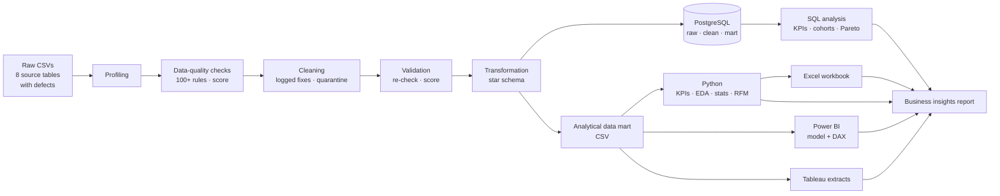
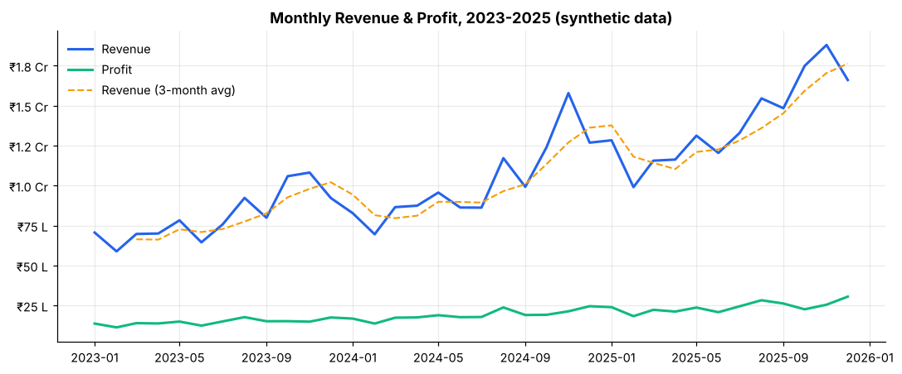
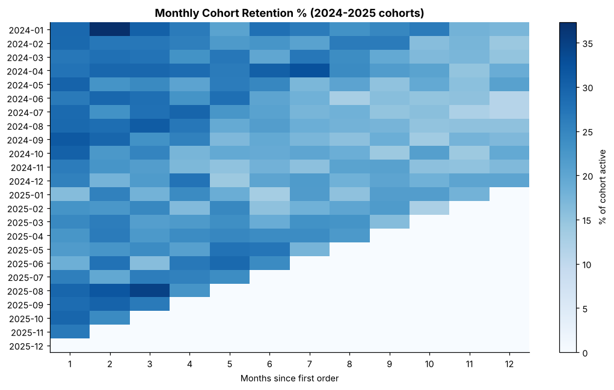
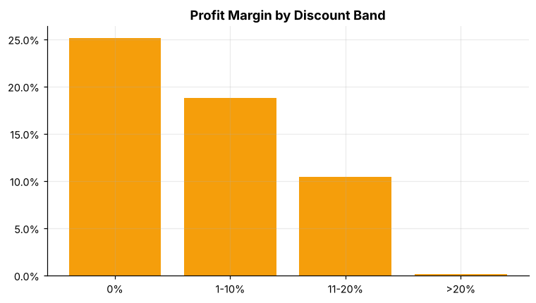
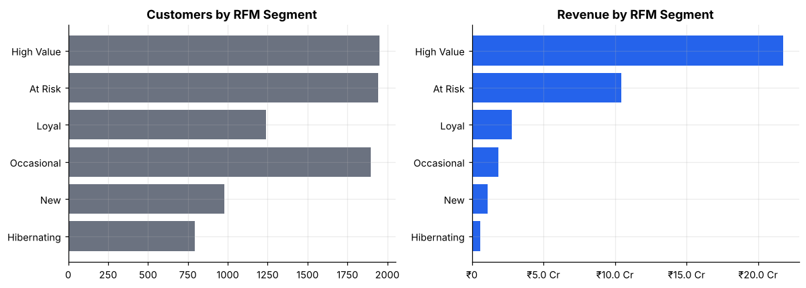

# Enterprise Sales, Customer & Operations Analytics Platform

**An end-to-end data analytics project:** messy raw data → profiling → data-quality checks → cleaning → star schema
→ PostgreSQL → SQL / Python analysis → Excel, Power BI and Tableau → business insights. It is fully reproducible with one command.

 
 


> ⚠️ **Data disclaimer.** The company **"UrbanCart Retail"** is fictional and all data is **synthetic**, generated by this
> project (`seed = 42`). The numbers show the analysis workflow. They are **not** real business results, and the author did not work for this company.

---

## 1. Project overview
UrbanCart is a fictional Indian omni-channel retailer that sells about 520 products in 7 categories across 24 cities (5 zones) through
4 channels (Website, Mobile App, Marketplace, Retail Store). Management wants one trusted view of **sales,
customers, products, profitability and operations**. The source systems export messy data.

### Business problem
* Revenue reports did not match because of duplicate orders, duplicate customer accounts and inconsistent labels.
* No view of profitability by category, discount level or channel.
* No customer segmentation, retention or churn tracking.
* Returns and support performance (SLA, CSAT) were not measured.

### Objectives
1. Build an automated, logged pipeline that **detects, scores and fixes** data-quality problems.
2. Model the data as a **star schema** in PostgreSQL for BI tools.
3. Answer 25+ business questions with **SQL** (CTEs, window functions, cohorts, Pareto).
4. Produce **KPIs, EDA, statistics and RFM segmentation** in Python.
5. Deliver **Excel**, **Power BI** and **Tableau** reporting assets and a written **insights report**.

## 2. Dataset
| Table | Rows (raw) | Description |
|---|---|---|
| customers | 12,409 | 12,000 unique customers + duplicate re-registrations and double-loaded rows |
| products | 525 | 520 products, 7 categories, 30 sub-categories |
| orders | 56,336 | 56,000 orders (Jan 2023 to Dec 2025) + duplicates |
| order_items | 110,047 | ~109.5k order lines |
| payments | 56,224 | one payment per order (6 methods) |
| returns | 8,919 | returned lines with reason and refund |
| regions | 24 | city → state → zone |
| support_tickets | 6,725 | tickets with priority, timestamps, CSAT |

**Why synthetic?** No public dataset has all eight related tables with consistent keys. The generator
(`python/ingestion/generate_synthetic_data.py`) simulates realistic behaviour: ~22% yearly growth, Oct-Nov festive peaks,
long-tail products, heavy-tailed customer spend, churn, channel-specific discounts and payments, category-specific
returns, and zone-specific delivery times. It then **injects realistic defects** (missing values, duplicates, duplicate customers,
inconsistent categories/regions/channels, whitespace, text-typed prices, invalid dates, impossible quantities, outliers,
orphan keys). Details: [docs/methodology.md](docs/methodology.md).

## 3. Architecture


## 4. Tech stack (all actually used)
| Area | Tools |
|---|---|
| Language | Python 3.11+ (pandas, NumPy, SciPy, matplotlib, openpyxl) |
| Database | PostgreSQL 16 (psql, PL/pgSQL helper functions, views, indexes) |
| BI | Power BI (data model, Power Query M, DAX), Tableau (extracts + calculated fields / LOD spec) |
| Spreadsheet | Excel: formulas, Tables, conditional formatting, data validation, charts |
| Notebooks | Jupyter (5 executed notebooks) |
| Engineering | modular packages, logging, reproducible seed, Git/GitHub |

## 5. Project structure
```
enterprise-data-analytics/
├── run_pipeline.py              # one-command pipeline (15 logged steps)
├── requirements.txt
├── data/
│   ├── raw/                     # generated source CSVs (git-ignored, reproducible)
│   ├── processed/               # clean/, mart/ (star schema), tableau/, quarantine/ (git-ignored)
│   └── outputs/                 # KPIs, DQ results, statistics, segmentation, SQL results, charts (committed)
├── python/
│   ├── config.py                # paths, constants, logging
│   ├── ingestion/               # synthetic data generator, raw loader
│   ├── validation/              # profiling, quality checks & scoring
│   ├── cleaning/                # cleaning rules + issue log
│   ├── transformation/          # star schema, Tableau extracts
│   ├── analysis/                # KPIs, RFM segmentation, statistics
│   ├── visualization/           # chart helpers + EDA charts
│   ├── reporting/               # Excel builder, report writer, notebook builder
│   └── database/                # PostgreSQL loader (psql)
├── sql/                         # 01_schema … 09_advanced_sql
├── notebooks/                   # 01_data_profiling … 05_statistical_analysis (executed)
├── excel/                       # analytics_dashboard.xlsx + README (Power Query workflow)
├── powerbi/                     # data_model.md, dax_measures.md, dashboard_design.md, power_query.m
├── tableau/                     # tableau_dashboard.md
└── docs/                        # data_dictionary, data_quality, methodology, business_insights
```

## 6. Data pipeline
`python run_pipeline.py` runs these steps with timestamped logging (`data/outputs/pipeline.log`):

| # | Step | Output |
|---|---|---|
| 1-2 | Generate (first run) and load raw data as text | `data/raw/*.csv` |
| 3 | Profile every column | `outputs/data_quality/profile_raw.csv` |
| 4 | 108 rule checks on RAW + DQ score | `dq_checks_raw.csv` |
| 5 | Clean (42 logged fix rules, quarantine) | `processed/clean/`, `cleaning_issue_log.csv` |
| 6 | Re-run checks on CLEAN; **stop if quality decreased** | `dq_checks_clean.csv`, `dq_scores.csv` |
| 7-8 | Star schema + RFM segments | `processed/mart/`, `processed/tableau/` |
| 9-11 | KPIs, statistics, 15 charts | `outputs/kpis/`, `outputs/statistics/`, `outputs/charts/` |
| 12-14 | Excel workbook, Markdown reports, executed notebooks | `excel/`, `docs/`, `notebooks/` |
| 15 | *(--with-postgres)* load PostgreSQL, run all 9 SQL files | `outputs/sql_results/*.txt` |

## 7. Data model (star schema)
**Facts:** `FactSales` (order line), `FactReturns` (returned line), `FactSupport` (ticket)
**Dimensions:** `DimDate`, `DimCustomer` (with RFM), `DimProduct`, `DimRegion`, `DimChannel`
Integer surrogate keys and an **Unknown (-1) member** keep revenue from orphan keys. Full PK/FK, types and business
definitions: [docs/data_dictionary.md](docs/data_dictionary.md) (includes an ER diagram).

## 8. Data cleaning & quality
| | Raw | Clean |
|---|---|---|
| Overall DQ score | **97.94** | **99.89** |
| Orders table | 95.26 | 99.95 |
| Regions table | 94.44 | 100.00 |

Examples of what was fixed (all logged with *why / how detected / how fixed / rows*):
289 duplicate customer accounts merged by normalised e-mail, 336 double-loaded orders removed, 144 invalid order dates
recovered from payment dates, invalid quantities (0, −1, 999) re-derived from line amounts, ₹-formatted text prices
converted, 23 category spellings standardised to 7, orphan keys mapped to Unknown members, and unrepairable rows quarantined.
Full report: **[docs/data_quality.md](docs/data_quality.md)**.

## 9. SQL analysis (PostgreSQL)
| File | Content |
|---|---|
| `01-03` | schemas (raw/clean/mart), tables with PK/FK/CHECK constraints, indexes |
| `04_data_quality.sql` | completeness, duplicates, type validity (safe-cast PL/pgSQL), date/range checks, IQR outliers, label variants, anti-join integrity, payment reconciliation |
| `05_cleaning.sql` | SQL cleaning (CASE mapping, ROW_NUMBER/FIRST_VALUE de-dupe, regex parsing, cost imputation) + reconciliation with the Python mart |
| `06_views.sql` | `vw_sales`, `vw_orders`, `vw_monthly_kpis`, `vw_customer_summary` |
| `07_kpi_queries.sql` | headline KPIs, monthly revenue/profit/orders, MoM & YoY (LAG), running, rolling 3M/12M (window frames), AOV, returns, SLA |
| `08_business_analysis.sql` | top/bottom products (UNION ALL), repeat customers, retention, churn proxy, category/region/channel, discount bands, CLV proxy, correlated subqueries, HAVING |
| `09_advanced_sql.sql` | ROW_NUMBER vs RANK vs DENSE_RANK, Pareto, NTILE deciles, cohort retention, LAG/LEAD order gaps, AVG/SUM OVER PARTITION, **query-optimisation notes + EXPLAIN** |

The SQL headline KPIs match the Python KPIs exactly (revenue ₹38,62,59,523.12, 54,640 orders, 8,802 customers).
Query outputs are saved in [`data/outputs/sql_results/`](data/outputs/sql_results/).

## 10. Python analysis
* **EDA** (15 charts): trend, YoY, category/region/channel mix, margin, Pareto, cohort heat map, RFM, returns, distribution, support, DQ.
* **Statistics:** descriptive statistics (mean, median, mode, SD, percentiles, skew), Spearman correlation, IQR outliers and 5 hypothesis tests.
* **Notebooks:** [`notebooks/`](notebooks/) are executed with outputs, so GitHub renders them directly.

| Monthly revenue & profit | Cohort retention |
|---|---|
|  |  |
| **Profit margin by discount band** | **RFM segments** |
|  |  |

## 11. Excel analysis
`excel/analytics_dashboard.xlsx` has 11 sheets (Raw_Data → Executive_Report) driven by **live formulas**: XLOOKUP, INDEX/MATCH,
SUMIFS, COUNTIFS, AVERAGEIFS, IF/IFS/IFERROR, RANK.EQ, DATE/YEAR/MONTH/TEXT, plus Excel Tables, dropdowns (data validation),
conditional formatting and native charts. A cross-check panel compares Excel totals with the Python results.
Power Query workflow and PivotTable steps: [excel/README.md](excel/README.md).

## 12. Power BI dashboard
Ready-to-build model for 6 pages (Executive, Sales, Customer, Product, Operations & Returns, Data Quality):
[data model & relationships](powerbi/data_model.md) · [40+ DAX measures](powerbi/dax_measures.md) (time intelligence, retention,
rolling totals, CLV, SLA) · [page-by-page design](powerbi/dashboard_design.md) · [Power Query M](powerbi/power_query.m).
*A `.pbix` file can only be created in Power BI Desktop. Screenshots will be added once it is built; none are faked.*

## 13. Tableau
Four flat extracts (`data/processed/tableau/`) plus calculated fields, LOD expressions and 3 dashboard specs:
[tableau/tableau_dashboard.md](tableau/tableau_dashboard.md).

## 14. Statistical analysis (α = 0.05, observational)
| Test | Method | Result |
|---|---|---|
| Deep discount (≥15%) vs other orders: order value | Mann-Whitney U | Deep-discount orders have a **lower** median value (₹2,344 vs ₹3,213), p < 0.001 |
| Return rate Marketplace vs Website | two-proportion z-test | 10.7% vs 8.1%, significant |
| Loyalty members vs non-members: orders | Mann-Whitney U | members order more; self-selection limits causal reading |
| Resolution time vs CSAT | Spearman | strong negative association |
| Order value across channels | Kruskal-Wallis | p = 0.026: statistically significant but a small rupee gap |

Each test documents its hypothesis, H0/H1, metric, method, result, interpretation and limitations
([notebook 05](notebooks/05_statistical_analysis.ipynb)).

## 15. Customer segmentation (RFM)
Recency, Frequency and Monetary are scored 1-5 by quintile. Rule-based segments: **High Value, Loyal, New, Occasional, At Risk, Hibernating**
(rules in [docs/methodology.md](docs/methodology.md)). High Value customers are 22% of buyers and bring 56.5% of revenue. At Risk customers hold 27% of
historical revenue, which makes them the main win-back target.

## 16. Key business insights *(synthetic data)*
* Revenue **₹38.63 Cr**, profit **₹6.92 Cr** (17.9% margin), 54,640 orders, AOV ₹7,069. Revenue grew 26% in 2024 and 37% in 2025.
* Strong **festive seasonality** (Oct-Nov). The top 20% of customers generate **65.9%** of revenue.
* Margin falls from **25%** on undiscounted lines to about **0%** above 20% discount.
* Fashion has the highest margin but also the highest return rate (Size/Fit is the top return reason).
* East zone has the lowest on-time delivery rate. Support SLA attainment is 75%, and slower resolution goes with lower CSAT.

Full report with tables, actions and limitations: **[docs/business_insights.md](docs/business_insights.md)** (auto-generated from the data).

## 17. How to run
```bash
git clone https://github.com/<your-username>/enterprise-data-analytics.git
cd enterprise-data-analytics
python -m venv .venv && source .venv/bin/activate      # Windows: .venv\Scripts\activate
pip install -r requirements.txt
python run_pipeline.py                                   # ~1-2 minutes, creates all data & outputs
```
**With PostgreSQL** (optional): credentials come only from environment variables, never from the code.
```bash
# macOS/Linux                                  # Windows PowerShell
export PGHOST=localhost PGUSER=postgres        # $env:PGHOST="localhost"; $env:PGUSER="postgres"
export PGPASSWORD=<your_password>              # $env:PGPASSWORD="<your_password>"
python run_pipeline.py --with-postgres         # creates DB 'enterprise_analytics', loads raw + mart, runs sql/01-09
```

## 18. How to reproduce
* Same seed → identical data and results (`python run_pipeline.py --regenerate` rebuilds the raw data).
* Power BI: follow `powerbi/data_model.md` → paste `power_query.m` → add `dax_measures.md` → build pages from `dashboard_design.md`.
* Tableau: connect to `data/processed/tableau/*.csv` and follow `tableau/tableau_dashboard.md`.
* Notebooks: `jupyter notebook notebooks/` (or rebuild with `python -m python.reporting.build_notebooks`).

## 19. Future improvements
* Orchestrate with Airflow/Prefect and add incremental (CDC) loads; dbt models and tests for the SQL layer.
* Publish the Power BI report / Tableau Public dashboards and add screenshots.
* Add a proper randomised A/B test design (power analysis) for the discount-cap recommendation.
* Demand forecasting (seasonal baseline) and a predictive CLV model (BG/NBD), only where they add business value.
* Unit tests (pytest) for cleaning rules and CI with GitHub Actions.

---
*Author: Vivek Prasad · B.Tech CSE · Portfolio project built to demonstrate data analyst skills on synthetic data.*
