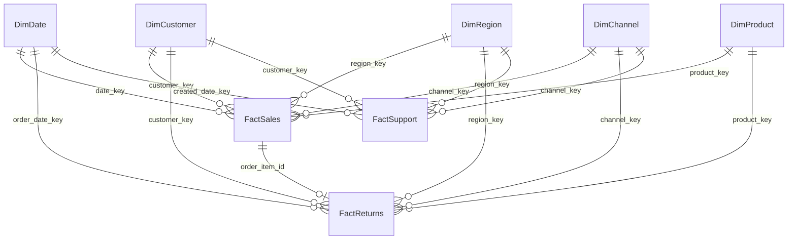

# Data Dictionary

All data is **synthetic** (fictional company *UrbanCart Retail Pvt. Ltd.*), generated by
`python/ingestion/generate_synthetic_data.py` with seed 42. Currency: Indian Rupees (INR). Period: 2023-01-01 to 2025-12-31.

## 1. Data layers

| Layer | Location | Description |
|---|---|---|
| Raw | `data/raw/*.csv`, PostgreSQL `raw.*` | Source extracts with deliberate quality defects, loaded as text |
| Clean | `data/processed/clean/*.csv`, PostgreSQL `clean.*` | Typed, de-duplicated, standardised tables |
| Mart | `data/processed/mart/*.csv`, PostgreSQL `mart.*` | Star schema for Power BI / SQL analysis |
| Tableau | `data/processed/tableau/*.csv` | Flat, denormalised extracts |

## 2. Raw source tables

| Table | Rows (approx.) | Grain | Key columns |
|---|---|---|---|
| customers.csv | 12.4k | one customer registration (with duplicates) | customer_id, email, region_id, signup_date |
| products.csv | 525 | one product | product_id, category, unit_price, unit_cost |
| orders.csv | 56.3k | one order header | order_id, customer_id, order_date, channel, region_id, order_status |
| order_items.csv | 110k | one order line | order_item_id, order_id, product_id, quantity, unit_price, discount_pct, line_amount |
| payments.csv | 56.2k | one payment per order | payment_id, order_id, payment_method, amount, payment_status |
| returns.csv | 9k | one returned order line | return_id, order_item_id, return_reason, refund_amount |
| regions.csv | 24 | one city | region_id, city, state, region_name (zone) |
| support_tickets.csv | 6.6k | one support ticket | ticket_id, order_id, created_at, resolved_at, priority, csat_score |

## 3. Star schema

Relationships are **one-to-many, single direction** (dimension filters fact). Key `-1` = "Unknown" member
(orphan customer/product/channel), so no fact row is lost.

### FactSales: grain = one order line of a non-cancelled order
| Column | Type | Key | Business definition |
|---|---|---|---|
| sales_key | BIGINT | PK | Surrogate key |
| order_item_id | VARCHAR | UK | Source order-line id (degenerate dimension) |
| order_id | VARCHAR | | Order number (degenerate dimension; count distinct = orders) |
| date_key | INT | FK → DimDate | Order date (YYYYMMDD) |
| customer_key | INT | FK → DimCustomer | Buyer |
| product_key | INT | FK → DimProduct | Product sold |
| region_key | INT | FK → DimRegion | Ship-to city |
| channel_key | INT | FK → DimChannel | Sales channel |
| quantity | INT | | Units sold (1-50) |
| unit_price | NUMERIC(12,2) | | List price per unit at order time |
| discount_pct | NUMERIC(6,4) | | Discount fraction (0-0.6) |
| gross_amount | NUMERIC(14,2) | | quantity × unit_price |
| discount_amount | NUMERIC(14,2) | | gross_amount − net_revenue |
| net_revenue | NUMERIC(14,2) | | **Revenue** = amount charged after discount |
| cost_amount | NUMERIC(14,2) | | quantity × unit_cost (COGS) |
| profit | NUMERIC(14,2) | | net_revenue − cost_amount (gross/contribution profit) |
| payment_method | VARCHAR | | UPI, Credit Card, … (Unknown if missing) |
| order_status | VARCHAR | | Delivered / Shipped |
| delivery_days | INT | | Delivery date − order date (0 for Retail Store) |
| is_on_time | BOOLEAN | | delivery_days ≤ promised days (NULL if not yet delivered) |
| is_returned | BOOLEAN | | Line appears in FactReturns |

### FactReturns: grain = one returned order line
| Column | Type | Key | Definition |
|---|---|---|---|
| return_key | BIGINT | PK | Surrogate key |
| return_id | VARCHAR | UK | Source return id |
| order_item_id | VARCHAR | FK → FactSales | Returned line |
| order_date_key / return_date_key | INT | FK → DimDate | Original order date / return date (NULL when the source date was impossible) |
| customer_key, product_key, region_key, channel_key | INT | FK | Inherited from the sale |
| return_qty | INT | | Units returned |
| refund_amount | NUMERIC | | Value refunded |
| return_reason | VARCHAR | | Standardised reason (7 values + Not Specified) |
| return_status | VARCHAR | | Refunded / Replaced |
| return_date_invalid | BOOLEAN | | Data-quality flag |

### FactSupport: grain = one support ticket
| Column | Type | Key | Definition |
|---|---|---|---|
| ticket_key | BIGINT | PK | Surrogate key |
| ticket_id, order_id | VARCHAR | UK / | Source ids |
| created_date_key | INT | FK → DimDate | Ticket creation date |
| customer_key, region_key, channel_key | INT | FK | Context of the related order |
| created_at / resolved_at | TIMESTAMP | | Open and resolution time |
| resolution_hours | NUMERIC | | resolved_at − created_at in hours |
| ticket_category | VARCHAR | | Return/Refund, Delivery Delay, Payment Issue, Product Query, Account/Login, Product Defect |
| priority | VARCHAR | | Low / Medium / High / Critical / Unassigned |
| sla_target_hours | INT | | Critical 8, High 24, Medium 48, Low & Unassigned 72 |
| sla_met | BOOLEAN | | resolution_hours ≤ sla_target_hours |
| csat_score | NUMERIC | | Customer satisfaction 1-5 |
| ticket_status, agent_channel, timestamp_invalid | | | Status, contact channel, DQ flag |

### DimDate
`date_key` (PK, YYYYMMDD), `date`, `year`, `quarter`, `month`, `month_name`, `year_month`, `month_start`, `week_of_year`,
`day_of_week` (1 = Mon), `day_name`, `is_weekend`, `is_festive_season` (Oct-Nov), `fiscal_year` (Indian FY Apr-Mar).
Covers 2022-07-01 to 2026-01-31 continuously (required for time intelligence in DAX).

### DimCustomer
| Column | Definition |
|---|---|
| customer_key (PK) / customer_id (UK) | Surrogate / business key; -1 = Unknown customer |
| full_name, gender, age, age_band | Demographics (invalid ages set NULL → "Unknown" band) |
| region_id, city, state, region_name | Home location |
| signup_date, signup_date_imputed | Registration date (imputed from first order when source invalid) |
| loyalty_member, preferred_channel | Programme membership, usual channel |
| first_order_date, cohort_month | First purchase and its month (cohort analysis) |
| recency_days, frequency, monetary | RFM inputs (snapshot 2026-01-01) |
| r_score, f_score, m_score, rfm_score, segment | RFM quintile scores and segment (see methodology.md) |

### DimProduct
`product_key` (PK), `product_id` (UK), `product_name`, `category` (7), `sub_category`, `brand`, `unit_price`,
`unit_cost`, `price_band` (Budget/Mid/Premium/Luxury), `cost_imputed` (DQ flag).

### DimRegion
`region_key` (PK), `region_id` (UK), `city`, `state`, `region_name` (zone: North, South, East, West, Central), `country`.

### DimChannel
`channel_key` (PK), `channel_id` (UK), `channel_name` (Website, Mobile App, Marketplace, Retail Store, Unknown), `channel_type` (Online/Offline).

## 4. KPI definitions

| KPI | Definition |
|---|---|
| Revenue | SUM(net_revenue) of non-cancelled orders |
| Profit / Margin | SUM(profit); Margin = Profit / Revenue |
| Orders | COUNT DISTINCT order_id |
| Customers | COUNT DISTINCT customer_key (excluding Unknown) |
| AOV | Revenue / Orders |
| Return rate | Returned lines / sold lines |
| Repeat customer % | Customers with ≥2 orders / purchasing customers |
| Retention % (yearly) | Customers active in year N and N+1 / customers active in year N |
| Churn proxy | Purchasing customers with no order in the last 180 days |
| CLV proxy | (Revenue / tenure months × 12) × company margin × 3-year horizon |
| On-time delivery | Orders with delivery_days ≤ promised_days / delivered orders |
| SLA met % | Tickets resolved within the priority SLA / resolved tickets |
